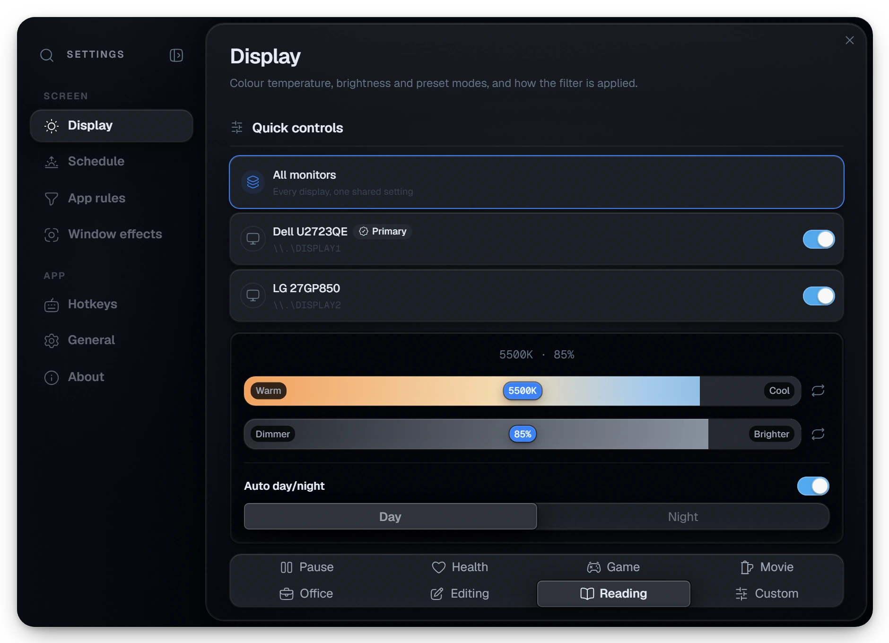
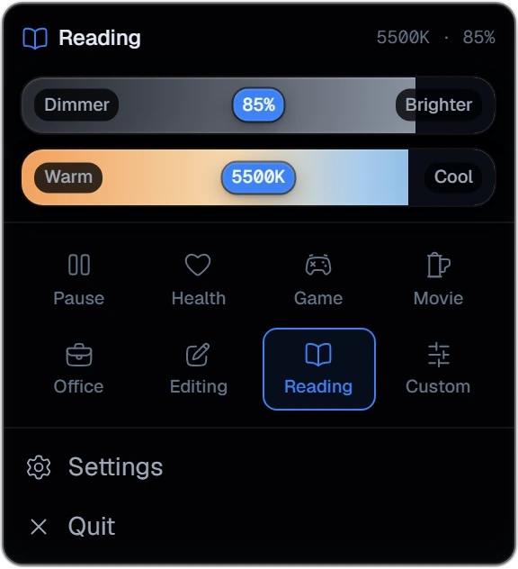

# DimRead

DimRead is a cross-platform **blue-light filter and screen dimmer** for Windows,
macOS, and Linux. Lower your display's color temperature and brightness with
per-monitor control, automatic day/night scheduling, one-click presets, and
settings-driven global hotkeys — so long reading and late-night sessions stay
easy on the eyes.

It is built on **Tauri v2 + React 19**: a small, native binary (no Electron)
with a design-system UI, a multi-window shell, and a system-tray flyout with
live sliders.

**Documentation:** <https://dahshury.github.io/dimread/docs> ·
**Latest alpha:** [GitHub Releases](https://github.com/dahshury/dimread/releases)

<p align="center">
  
</p>

## Download

One click, straight to the file — no scrolling through the releases page.

<!-- DOWNLOAD_BADGES:START -->

<p align="center">
  <a href="https://github.com/dahshury/dimread/releases/download/v0.0.3-alpha/DimRead.exe"></a>
  &nbsp;
  <a href="https://github.com/dahshury/dimread/releases/download/v0.0.3-alpha/DimRead_0.0.3-alpha_aarch64.dmg"></a>
  &nbsp;
  <a href="https://github.com/dahshury/dimread/releases/download/v0.0.3-alpha/DimRead_0.0.3-alpha_amd64.AppImage"></a>
</p>

<p align="center">
  <sub><a href="https://github.com/dahshury/dimread/releases/download/v0.0.3-alpha/DimRead-portable.zip">Windows portable (.zip)</a> · <a href="https://github.com/dahshury/dimread/releases/download/v0.0.3-alpha/DimRead_0.0.3-alpha_x64-x86_64.dmg">macOS (Intel)</a> · <a href="https://github.com/dahshury/dimread/releases/download/v0.0.3-alpha/DimRead_0.0.3-alpha_amd64.deb">Debian / Ubuntu (.deb)</a> · <a href="https://github.com/dahshury/dimread/releases/download/v0.0.3-alpha/DimRead-0.0.3-alpha-1.x86_64.rpm">Fedora / RHEL (.rpm)</a> · <a href="https://github.com/dahshury/dimread/releases/tag/v0.0.3-alpha">All v0.0.3-alpha assets</a></sub>
</p>

<!-- DOWNLOAD_BADGES:END -->

> **Windows is portable — no installer.** Download `DimRead.exe`, run it, and it
> keeps its data next to the executable (in a `Data/` folder) with no registry
> writes. The portable `.zip` needs the Microsoft Edge **WebView2** runtime,
> which ships with Windows 11 and most Windows 10 installs.
>
> This is a **0.0.3 alpha** pre-release. Builds are unsigned, so the OS may warn
> on first launch — see [First-run notes](#first-run-notes) below.

## What it looks like

<!-- SCREENSHOTS:START -->

<p align="center">
  
</p>

<p align="center">
  
  &nbsp;&nbsp;
  
</p>

<p align="center">
  <sub>Every image is captured from the real renderer by
  <code>bun run docs:shots</code> — see <a href="#documentation">Documentation</a>.</sub>
</p>

<!-- SCREENSHOTS:END -->

## Features

- **Color temperature + brightness** — warm the display (reduce blue light) and
  dim it in software, from a single compact panel.
- **Per-monitor control** — adjust every display together or pick one; the panel
  follows your monitor layout.
- **Automatic day/night** — smooth scheduled transitions between a day and a
  night profile, re-applied as the clock advances and after wake.
- **One-click presets** — Health, Reading, Office, Editing, Game, Movie, Custom,
  and Pause, each a tuned temperature/brightness pair.
- **Focus tools** — Focus Blur and Magic Window for distraction-free reading.
- **System-tray flyout** — real sliders in a tray-anchored popup, plus a
  top-center notification overlay for hotkey feedback.
- **Global hotkeys** — settings-driven shortcuts, hot-swapped without a restart.
- **Native and light** — a Tauri v2 binary with a Base UI + Tailwind v4 design
  system; no Electron, small downloads.

## First-run notes

DimRead's alpha builds are not code-signed or notarized yet, so each OS shows a
one-time "unknown developer" prompt:

- **Windows** — SmartScreen may say "Windows protected your PC." Click **More
  info → Run anyway**.
- **macOS** — right-click the app → **Open**, then confirm, or run
  `xattr -dr com.apple.quarantine /Applications/DimRead.app`.
- **Linux (AppImage)** — mark it executable (`chmod +x DimRead_*.AppImage`) and
  run it. The `.deb`/`.rpm` install a normal desktop entry.

## Build from source

Prerequisites: [Bun](https://bun.sh), [Rust (stable)](https://rustup.rs), and the
[Tauri v2 platform prerequisites](https://v2.tauri.app/start/prerequisites/) for
your OS.

```sh
bun install      # installs deps + git hooks
bun run dev      # launch the desktop app (tauri dev)
```

### Package the app

All bundle scripts use the `tools/tauri-ci-artifacts.conf.json` overlay
(`bundle.createUpdaterArtifacts: false`), so no signing key is needed.

```powershell
# Windows — portable executable + zip (no installer is published)
tools\windows\tauri-build.ps1
tools\windows\tauri-portable.ps1     # → dist\DimRead.exe, dist\DimRead-portable.zip
```

```sh
# Linux — AppImage + deb + rpm  → dist/linux/
bash tools/linux/tauri-bundles.sh

# macOS — dmg + .app archive  → dist/macos/<arch>/
bash tools/macos/tauri-bundles.sh aarch64-apple-darwin aarch64
bash tools/macos/tauri-bundles.sh x86_64-apple-darwin x86_64
```

Pushing a `v*` tag runs [`.github/workflows/release.yml`](.github/workflows/release.yml),
which builds all three platforms and attaches the **portable** Windows binaries,
Linux AppImage/deb/rpm, and macOS dmg/app archives to a GitHub release. Versions
must stay in lockstep across `package.json`, `src-tauri/tauri.conf.json`, and
`src-tauri/Cargo.toml`.

## Architecture

The frontend follows **[Feature-Sliced Design](https://feature-sliced.design/)
(FSD v2.1)** (`app → views → widgets → features → entities → shared`, imports
pointing strictly downward), enforced by a deterministic checker:

```sh
bun run check:fsd
```

The Rust backend is organized by infrastructure concern (`windows/`, `settings/`,
`downloads/`, `hotkeys/`, `overlay/`, `tray_menu/`, `bootstrap/`), with typed IPC
generated by tauri-specta — after changing commands or events, regenerate
`src/bindings.ts` with `cd src-tauri && cargo test export_bindings`.

Re-skinning happens in the `@theme` blocks of `src/app/styles/globals.css`. See
[`AGENTS.md`](AGENTS.md) for the full contributor/agent guide (architecture
boundaries, verification gates, and the template rename checklist).

## Documentation

The user-facing docs live in [`docs-site/`](docs-site/) — a
[Fumadocs](https://fumadocs.dev) site on React Router + Vite, published to
GitHub Pages by [`.github/workflows/docs.yml`](.github/workflows/docs.yml) and
linked from the app's **About** tab.

```sh
bun run docs:dev      # http://localhost:5173/dimread/docs
bun run docs:build    # static output → docs-site/build/client
```

Every screenshot on that site (and in this README) is a capture of the **real
renderer**, not a mock-up. `tools/docs/capture-screenshots.mjs` injects a small
mock of the Tauri IPC bridge, drives the actual windows with Playwright, and
reads the settings defaults straight from the app's own zod schema — so the
values in the pictures cannot drift from the values in the code:

```sh
bun run dev:vite      # in one terminal
bun run docs:shots    # in another → docs-site/public/screenshots/*.webp
```

## Verification gates

```sh
bun run lint          # Biome + i18n literal guard
bun run typecheck     # app + node
bun run test          # bun test ./src
bun run check:fsd     # FSD structure
bun run check:i18n    # message-key parity
bun run check:deadcode
bun run check:react   # react-doctor (blocks on errors)
cd src-tauri && cargo fmt --check && cargo clippy --all-targets && cargo test
```

The docs site has its own gates, run by the Docs workflow:

```sh
cd docs-site && bun run typecheck && bun run build && bun run check:links
```

## License

[MIT](LICENSE)
